# GDD - Recoil

Marco González Campo, 2025

Grado de Desarrollo de Videojuegos, Programación de Videojuegos en Lenguajes interpretados.

Universidad Complutense de Madrid.

---

## ¿Qué es Recoil?

Recoil es un juego rápido de plataformas y acción 2D de un solo jugador, basado en físicas, en el que te mueves e interactúas con el mundo mediante una escopeta que te impulsa en base a donde dispares. 

El objetivo es pasar pantallas llegando al final del nivel, nivel en el que tendrás que sortear obstáculos y peligros del entorno para avanzar.

La perspectiva es diédrica 2D, el jugador controla al personaje principal con controles de teclado y ratón. Para avanzar por el nivel el jugador tendrá a su disposición saltos, movimientos y disparos. 

---

## Principios de diseño

Recoil se presenta como un desafío de reflejos y precisión en el que se recompensa el uso del instinto y toma rápida de decisiones. Para avanzar el jugador debe hacer uso de su conocimiento de como interactúan las mecánicas de movimiento y fuerzas así como conocer los diferentes peligros que se puedan presentar en el entorno.

Se tiene como referencia Super Meat Boy, en cuanto a la precisión, velocidad y poca penalización a la hora de cometer fallos. Al igual que en super meat boy, los niveles se plantean realmente como puzles que se resuelven con tus reflejos y la experiencia. No pasa nada por fallar, de hecho, se recompensa el haber aprendido de tus errores.

Los disparos son un elemento clave ya que mediante el retroceso de la escopeta, se provee una libertad de movimiento mucho mayor que con el movimiento propio del jugador. Un ejemplo de como se pretende que sean los impulsos de disparos es el [angle jumping de Duck Game](https://www.youtube.com/watch?v=ZpsQM0KVE_w).

Los proyectiles disparados por la escopeta no son infinitos y se tienen en cuenta como objetos activadores para cosas como abrir caminos o accionar botones, es decir, hacia donde se dirigen los proyectiles puede haber un punto de avance, pero el disparo envía al jugador al lugar opuesto, esto añade una capa adicional de complejidad.

Se pretende crear en los jugadores un estado de hiperalerta y tensión positiva utilizando para ello una alta velocidad de movimiento basado en físicas y el requerimiento constante de input por parte del jugador. Además se pretende que el jugador entre en "la zona" (estado de flujo) mediante una dificultad exigente, pero sin frustración prolongada al no penalizar los fallos de forma severa, no se pretende que sea un "rage game".

---

## Mecánicas

> [!INFO] Importante
>
> En los siguientes apartados se explican las mecánicas principales del juego.
> 
> Los motivos de diseño detrás de dichas mecánicas se indicarán en cajas de texto como esta.

- [Personaje jugador](#personaje-jugador)
- [Escopeta](#escopeta)
- [Entorno y escala](#entorno-y-escala)
- [Objetos, obstáculos y peligros](#objetos-obstáculos-y-peligros)
- [Muerte](#muerte)

---

### Personaje jugador

El jugador tendrá control sobre una única entidad, el PJ (Personaje Jugador). El PJ puede moverse de izquierda a derecha y puede saltar.

#### Movimiento horizontal

La aceleración lateral en el caminado (a) es fija hasta llegar al límite. La aceleración en el aire es menor.

> [!NOTE] Aceleración en el aire
>
> La aceleración en el aire es menor que en tierra para forzar al jugador a pensar bien sus movimientos y que no de por sentado que va a poder hacer ajustes en el aire tan precisos como es en tierra.
> 
> Fuerza el uso de la escopeta.

La velocidad horizontal está limitada en su máximo absoluto en 3 niveles:

(*Números sujetos a cambios*)

- Velocidad máxima en tierra (v)
- Velocidad de salto (v \* 1.25)
- Velocidad de impulso (v \* 10)

> [!NOTE] Limitadores por forma de moverse
> La velocidad es una herramienta de doble filo, se gana mayor movimiento a cambio de menor control. 
> 
> Para poder pasar determinadas plataformas se debe de hacer con una velocidad mayor a la estándar, como el propósito central es el uso de la escopeta, este es el caso en el que se va más rápido.

Para alcanzar la velocidad de impulso se debe utilizar la [[#Escopeta|escopeta]]. Para la de salto igual. Una vez por debajo de un limitador la única forma de superarlo es con sus métodos respectivos (salto, escopeta)

#### Movimiento vertical

Se aplica sobre el PJ una velocidad de gravedad constante. La aceleración inicial de salto es fija.

- Velocidad máxima en aire (v \* 3), máximo que puede mover solo la gravedad
- Velocidad de impulso vertical (v \* 10)

El PJ tiene la capacidad de realizar un salto, esta capacidad se renueva al tocar el suelo. La velocidad inicial de salto es fija.

#### Ajustes de fluidez

- **Coyote Time:** se permite el salto unos instantes tras abandonar una el suelo
- **Modificaciones de gravedad en salto**
	- Menor gravedad en la primera mitad de la parábola
	- Breves instantes de suspensión en el apex
	- Mayor gravedad en la segunda mitad de la parábola
- **Jump Buffering:** poner en cola órdenes de salto hechas instantes a tocar el suelo
- **Variable Jump Height:** si se deja de saltar (presionar input de salto) antes de que el salto haya llegado al apex se aplica un multiplicador a la gravedad, para finalizar antes el salto.
- **Collide & Slide:** (también aplicable al movimiento horizontal pero tiene mas uso en el vertical) Cuando el PJ choque contra el entorno en los laterales y parte superior, en lugar de parar, se desliza en la pared, restando un factor de fricción.

> [!NOTE] Ajustes de fluidez
>
> Se aplican todas estas técnicas para mejorar la fluidez, inmersión y sensación de control.
> 
> - **Coyote Time:** Tiene en cuenta el tiempo de reacción humano. Cuando se percibe estar en el filo de una plataforma, en el juego el personaje ya la ha abandonado.
> - **Modificaciones de gravedad en salto:** La reducción de gravedad y suspensión en apex permite mayor control y elimina la sensación de levitación. La caída rápida aporta seguridad de aterrizaje. En general, la parabola asimétrica es mas estilizada y se siente mas satisfactoria.
> - **Jump Buffering:** Misma razón que con Coyote Time. Despenaliza la reacción humana
> - **Variable Jump Height:** Permite al jugador hacer saltos mas cortos, haciendo el salto un movimiento mucho más flexible.
> - **Collide & Slide:** Lo previsible es que al chocar con una superficie, si no es un choque perpendicular, el personaje se arrastre al ángulo más abierto.

#### Colisión

El PJ posee una caja de colisión con la rotación bloqueada. La caja tiene forma de cápsula o rectángulo (según permita Phaser). La caja de colisión interactúa con otros objetos físicos y no puede atravesarlos.

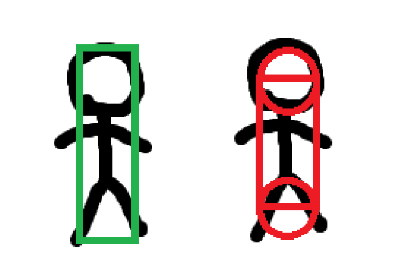

Cuando interactúa con una caja de daño (como [[#Objetos, obstáculos y peligros|pinchos]]), no hay una barrera física pero si que daña al jugador.

#### Daño

Cuando el PJ es dañado el nivel se reinicia, todas las posiciones de PJ, entidades no jugadores y número de disparos.

*Ver [Victoria y derrota](#victoria-y-derrota)*

---

### Escopeta

La escopeta es la mecánica principal del juego. Su función principal es la de proporcionar un impulso de aceleración fija de forma omnidireccional en las dos dimensiones.

La escopeta dispara físicamente desde un cañón anclado por eje al PJ. Este eje permite rotar la dirección de apuntado del cañón a donde el jugador desee.

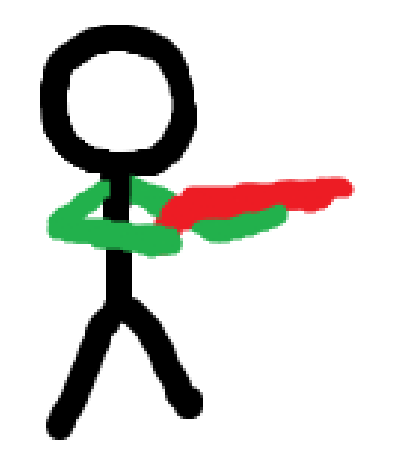

*Las partes verdes (brazos) y roja (escopeta) representan a donde apunta el cañón. El eje se sitúa entre los dos brazos.*

Entre disparo y disparo hay un tiempo de espera de centéstimas/décimas de segundos.

La fuerza de impulso del disparo debe de ser considerable, como mínimo el doble o triple de la fuerza de salto. La dirección del impulso es la opuesta a la del cañón.

> [!NOTE] La importancia de la escopeta
>
> La escopeta es central y es por ello que no debe de ser increíblemente fácil de usar. Es intuitiva pero la fuerza de impulso que proporciona es desproporcionada, y difícil de controlar. Esto es contrapesado por esa misma movilidad y la rapidez con la que mueve al jugador, una herramienta muy poderosa y que en los niveles siempre debe de ser necesaria ejecutar correctamente.
> 
> Se enfatiza en lo importante que es la inercia producida, encadenar disparos con el timing correcto es esencial, por ello se añade el tiempo de espera, que aunque corto, sirve como aviso al jugador de que el control de la cadencia es relevante.

#### Proyectil de la escopeta

La escopeta dispara un proyectil tipo hitscan retardado por centésimas de segundos. Este proyectil puede interactuar con [[#Objetos, obstáculos y peligros|determinados objetos]] en el impacto.

> [!NOTE] Retardo de disparo
>
> El disparo se retarda para dar tiempo a una animación muy rápida al punto de impacto, da mayor sensación de "realismo".

#### Munición

El PJ puede disparar tantas veces como munición tenga en ese momento. 

Se conoce en todo momento la munición disponible y es limitada. 

La munición puede recargarse en [puntos de recarga](#objetos-obstáculos-y-peligros).

> [!NOTE] El problema de limitar los disparos
>
> Limitar los tiros mediante la munición a nivel de diseño ayuda a que el jugador piense su estrategia de avance, pero presenta un problema mayor:
>
> ¿Qué ocurre si un jugador se queda sin munición y no puede avanzar?
> 
> Una solución posible sería dejar suficientes puntos de recarga como para que actúen de soft checkpoint, el jugador se da cuenta de que le falta munición y vuelve atrás. Esto puede ser bueno porque hace que el jugador se familiarice con el nivel y sea más consciente de sus acciones sin frustrarle al repetir el nivel de cero.

---

### Entorno y escala

Los niveles se construyen mediante un tilemap en cuadrícula. Cada cuadrado de la cuadrícula equivale aproximadamente a las dimensiones del PJ.

Todos los objetos del entorno pueden tener las siguientes propiedades:

- **Sólido:** El objeto no se puede atravesar (paredes, techo)
- **Estático:** El objeto no se mueve (meta)
- **Telegrafiado:** El objeto se mueve de una forma predeterminada, normalmente siguiendo un camino (plataformas móviles)
- **Interactivo:** El objeto reacciona a determinadas interacciones com disparos o contacto (munición, botones)
- **Dañino:** El objeto daña al jugador al contacto (foso, pinchos)

En cuanto a la escala, si establecemos que el juego se muestra en proporciones de 16:9, la altura del PJ es el 7-8% de la altura de la pantalla y de juego y el 2-3% del ancho.

Todos los elementos del mapa se diseñan respecto a esa escala

*Mockup de la escala*

Si decimos que un área de juego es la distancia dentro del juego conformada por el ancho y el alto de la pantalla de juego, los niveles por norma general tendrán un tamaño de entre 2x2 y 3x3 aproximadamente.

> [!NOTE] Tamaño de niveles
>
> Los niveles deben de ser lo suficientemente amplios como para que el jugador pueda dar rienda suelta al movimiento pero no tan grandes como para que cada nivel sea muy largo, ya que eso podría hacer que morir sea más penalizador de lo que se quiere.

#### Cámara

La cámara seguirá al PJ con interpolación lineal para suavizar el movimiento, pero solo cuando el jugador salga de un área relativa al punto de observación de la cámara. La cámara no seguirá al jugador cuando esté dentro del área azul, "choque con los límites del nivel".

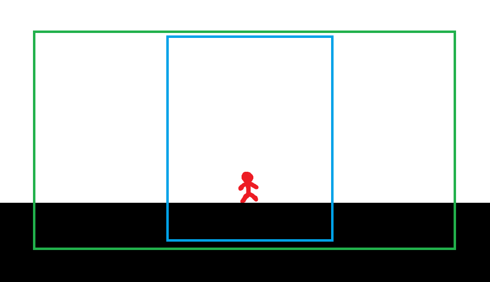

El área azul está fijada relativa al PJ. Es todo el área donde es posible que la cámara mire.

El área verde está fijada a la cámara. Si esa caja entra en contacto con los bordes del mapa la cámara deja de seguir al PJ hasta que el PJ se mueva a una dirección que haga que la cámara apunte en direcciones opuestas sin sobrepasar los límites.

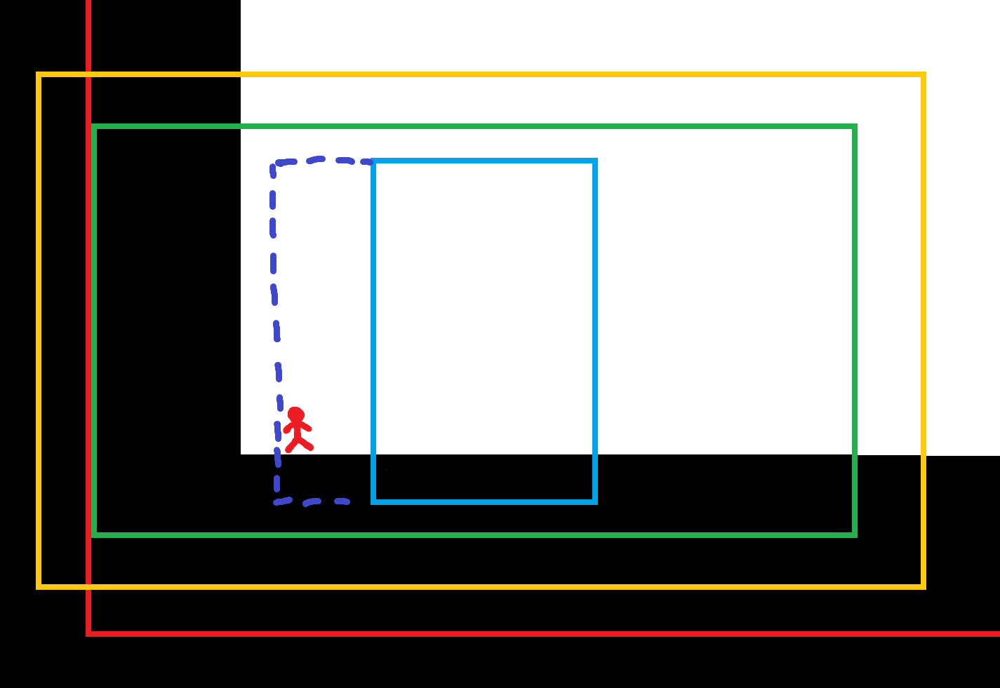

El área roja es relativa al nivel, indica los límites. El área amarilla representa la proyección de la cámara (lo que se vería en pantalla). El área de seguimiento se extiende en la dirección de un choque de la cámara con los límites del mapa.

> [!NOTE] Lo que muestra la cámara
>
> El objetivo es que la cámara muestre al PJ en el centro pero no aliene ni maree al jugador con seguimiento constante, por eso se deja en el centro una "deadzone de seguimiento".
> 
> Por encima de esa prioridad queda el mostrar la mayor cantidad de área jugable posible, simplemente porque al jugador no le interesa ver donde no va a poder estar, es espacio de la pantalla que no se utiliza.

---

### Objetos, obstáculos y peligros

> [!NOTE] Simplicidad de los elementos del nivel
>
> El principio es que los objetos sean sencillos y sirvan como bloques de construcción de niveles. La dificultad está en el diseño de niveles, no en la complejidad de sus elementos.

#### Objetos

- **Terreno:** Estático y sólido. Paredes, suelo techo, la cimentación del nivel
- **Munición:** Estática e interactivo. Al contacto otorga al jugador X cantidad específica de [munición](#munición), si y solo si el jugador tiene menos de la munición a dar. La cantidad de munición a obtener es visible en el propio objeto, de forma diegética (*Ej: sprite con número de cartuchos, cartucho con un número, etc)*
- **Meta:** Estática e interactiva. Al contacto finaliza el nivel
- **Botón:** Estático e interactivo. Al ser disparado envía una señal de activación a cualquier objeto que pueda recibirla (por ejemplo, una puerta)

#### Obstáculos

- **Plataforma móvil:** Telegrafiado y sólido. Se mueve por raíles invisibles a una velocidad fijada y en intervalos también fijados.
- **Puerta móvil:** Telegrafiado y sólido. Funciona como una plataforma móvil pero normalmente el movimiento ocurre una vez y es accionado por una señal interna (como la activación de un botón).

El terreno también actúa como obstáculo. Es la base del plataformeo

#### Peligros

Todos los peligros son objetos de tipo *dañino*.

- **Foso:** Estático e inmóvil. Más que un objeto es un área, normalmente están en caídas "fuera del mapa", hacia abajo en la pantalla.
- **Pinchos:** Estáticos e inmóviles. Si se entra en contacto con las caras puntiagudas daña al jugador.
- **Pinchos móviles:** Estáticos, inmóviles y telegrafiados. Igual que los pinchos pero se mueven como plataformas móviles.

---

### Muerte

Cuando el PJ es dañado (entra en contacto con un área de daño), el nivel se reinicia en la posición inicial. Todos los elementos del nivel se reinician. El progreso de niveles anterior no se pierde.

---

## Progresión por niveles

- [Estructura de un nivel](#estructura-de-un-nivel)
- [Progresión y dificultad](#progresión-y-dificultad)
- [Niveles](#niveles)

---

### Estructura de un nivel

Un nivel tiene siempre un estado inicial que guarda:

- La posición inicial del PJ
- Posiciones de objetos móviles (tanto telegrafiados como físicos)
- Estados de elementos activables (puertas) 

Cuando el jugador muere el estado inicial se carga.

Todos los niveles tienen una y solo una meta. Todos los niveles se pueden completar con las mecánicas del juego usando los recursos proveídos por el propio nivel.

---

### Progresión y dificultad

La sucesión de niveles a jugar es lineal. En una nueva partida se empieza en el nivel uno y se terminará en el nivel máximo. Cuando el jugador deja de jugar se guarda su progreso en base al último nivel completado en un archivo de guardado. Al cargar se empieza en el siguiente. 

Cada vez que el jugador muera se registra en su archivo de guardado. Cuando el jugador completa el último nivel se muestra el número total de muertes en el menú principal y solo se podrá comenzar una nueva partida.

Se proponen alrededor de 10-15 niveles para el juego base.

Se pretende que los niveles escalen en dificultad y en cada uno se vayan introduciendo nuevas propuestas de formas de jugar ("técnicas" de juego) y/o nuevas mecánicas.

> [!NOTE] Reto propuesto
>
> El juego progresa en dificultad para no frustrar al jugador, con cada nivel se va "entrenando" al jugador. Poco a poco permite que se manejen velocidades mas rápidas porque se espera mayores reflejos del jugador, y se le dan mas opciones, hay menos caminos únicos, mas plataformas opcionales. Pero también mayores riesgos, más cosas que te matan, huecos mas holgados, mas necesidad de reacción rápida

---

### Niveles

> [!INFO] Leyenda
>
> Las líneas rojas simbolizan por donde se pretende que el jugador se mueva, normalmente para completar el nivel. 
> 
> Los puntos rojos simbolizan puntos donde se dispara, la línea discontinua es donde se apunta y la flecha que sale (justamente en la dirección opuesta), es a donde te lanza el disparo.
> 
> Los objetos azules son todos los objetos dañinos.
> 
> La bandera verde es la meta
> 
> Las cajas naranjas/amarillas indican una recarga con el número de munición a recargar.

Se proponen los siguientes niveles.

#### 1 - Introducción a los movimientos del PJ

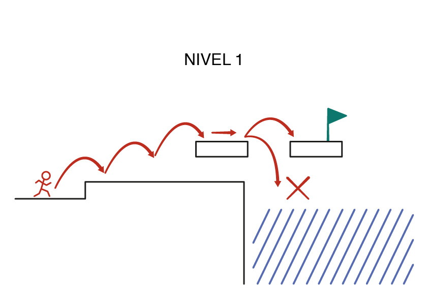

#### 2 - Introducción a la escopeta

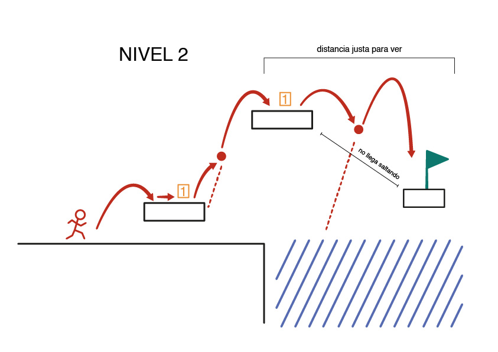

#### 3 - Familiarización con la escopeta

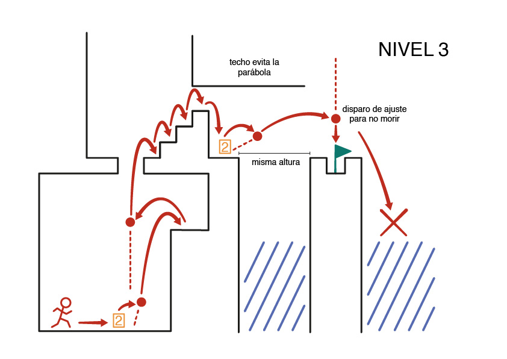

#### 4 - Dominio de la escopeta

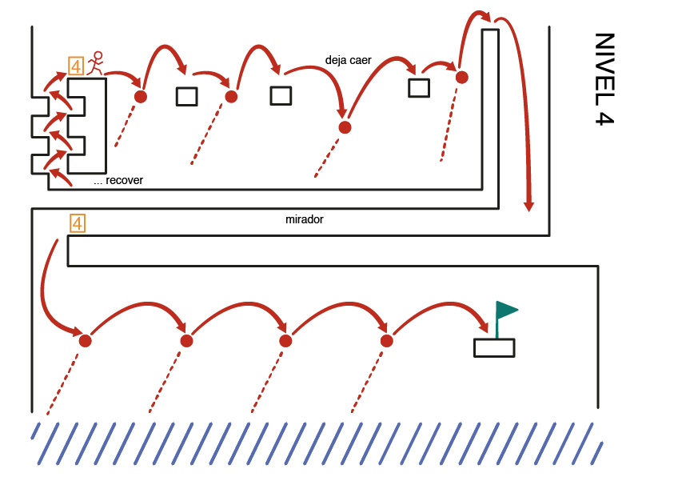

#### 5 - Pinchos

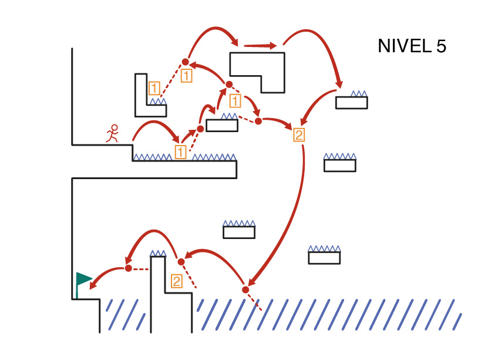

#### 6 - Pinchos 2

*(Por diseñar)*

#### 7 - Plataformas y pinchos móviles

*(Por diseñar)*

#### 8 - Botones

*(Por diseñar)*

#### 9 - Remix 1

*(Por diseñar)*

#### 10 - Remix 2

*(Por diseñar)*

---

## Visual

### Contador de munición

Cuando se esté en juego, en la esquina superior izquierda se mostrarán iconos (potencialmente de cartuchos de escopeta) alineados horizontalmente de izquierda a derecha.

El número de cartuchos visibles es el número de disparos disponibles.

### Menús

Existen los siguientes menús

#### Menú inicial

Lo primero en aparecer en el juego

- Título del juego
- Botón de nueva partida, inicia una nueva partida
- Botón de continuar partida, solo visible si existe una partida guardada, indica el nivel a jugar 
- Botón de volumen, activa el submenú de volumen
- Botón de controles, activa el submenú de controles
- Botón de créditos, activa el submenú de créditos

##### Submenú de volumen

Se despliega por encima del menú que lo invoca

- Barra de volumen, cambia el volumen del juego
- Botón de salir, cierra el submenú

##### Submenú de controles

Se despliega por encima del menú que lo invoca

- Gráficos con los controles del juego
- Botón de salir, cierra el submenú

##### Submenú de créditos

Se despliega por encima del menú que lo invoca

- Texto con los autores del jueg
- Botón de salir, cierra el submenú

#### Menú de pausa

Accesible solo en juego. Pone el juego en pausa

- Texto indicando la pausa
- Texto indicando el nivel actual
- Botón de volumen, activa el submenú de volumen
- Botón de restart, reinicia el nivel
- Botón de salir, vuelve al menú principal

### Estética general

Como referencias visuales se utilizan los juegos *Your Only Move Is Hustle* y *A Few Quick Matches*

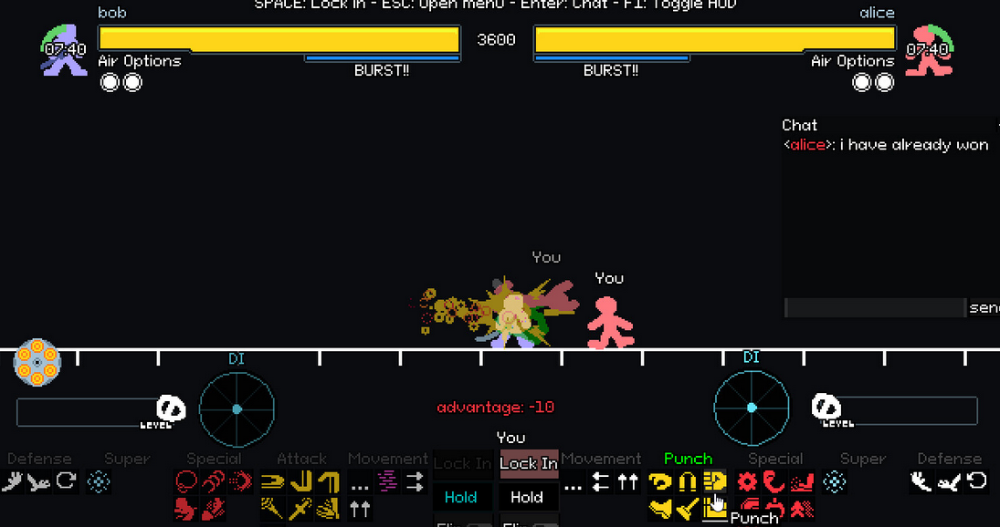

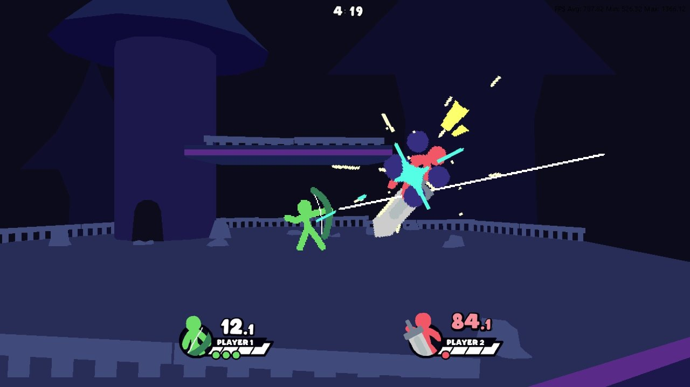

- Pixel art
- Colores lisos
- Stickman pixelados
- Fondos y entornos negros y blancos
- Asociado a estéticas Low-Fidelity y Flashcore
- Enemigos asociados a tonos fríos
- Jugador asociado a tonos cálidos
- Interfaces sencillas

---

## Sonido

En los efectos de sonido se utilizarán sonidos generados por sintetizador y efectos comprimidos para dar una sensación retro.

Para la música se utilizará un track loopeable de estilo Drum-&-Bass que recuerda a la música utilizada en la Play Station 2. Se le aplicará un filtro de paso bajo cuando se esté en cualquier lugar que no sea el juego en tiempo real (menús de pausa, menú principal, etc).