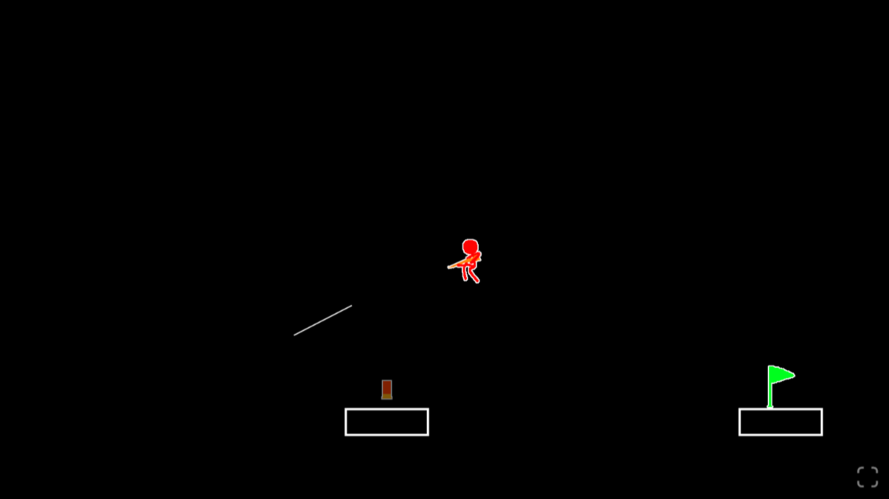
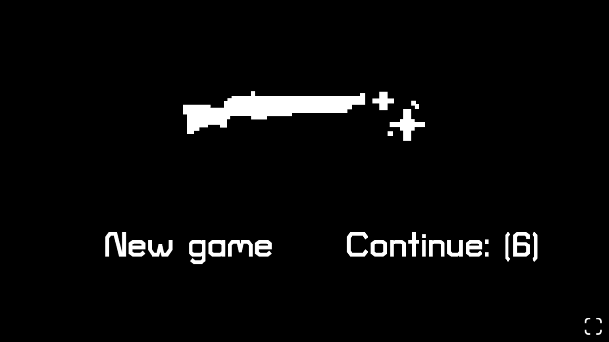

# Recoil

Este repositorio es un proyecto de la asignatura de Programación de Videojuegos en Lenguajes Interpretados, del Grado de Desarrollo de Videojuegos de la Universidad Complutense de Madrid.

Juego 2D de plataformas basado en físicas, hecho en Phaser

Click **[aquí](https://marco-1337.github.io/Recoil/)** para jugar

- [GDD](./GDD.md)
- [Autoría e información de los asstes](./assets/assets.md)
- [Arquitectura](./RecoilUML.png)

---

## Capturas

---

### Licencia del código

Todos los derechos reservados.
All rights reserved.